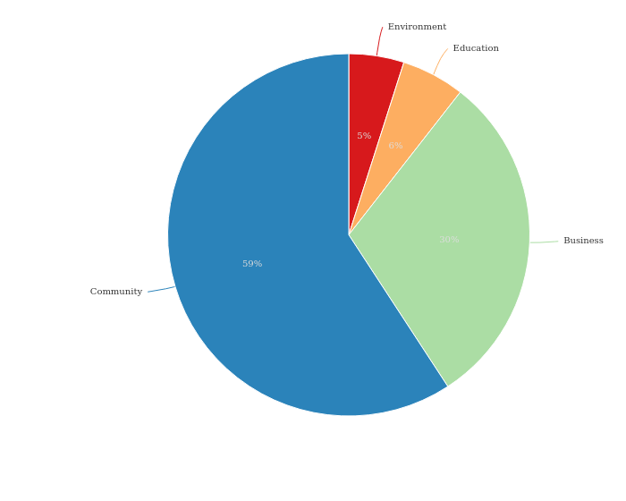
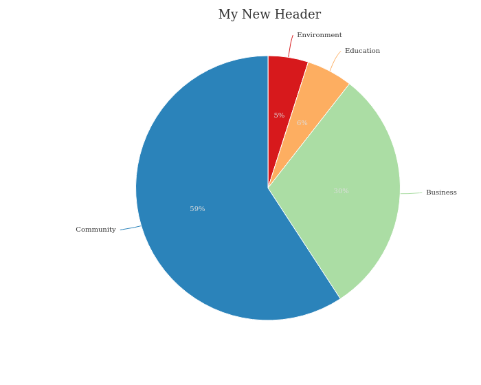
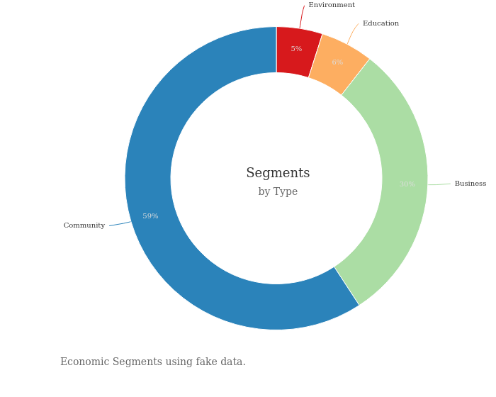

# pier


The `pier` package (pronounced pie-r) is a wrapper, or [htmlwidget](http://www.htmlwidgets.org/), for the [d3pie](http://d3pie.org/) javascript library by [Benjamin Keen](https://github.com/benkeen). If you are just wanting to generate a pie chart the d3pie website has a fantastic [generator](http://d3pie.org/#generator) that will create the code that you need. If you are wanting create a chart using [R](https://www.r-project.org/) for embedding in a Rmarkdown document or Shiny App, then you are in the right place.  

The `d3pie` library is very versatile and includes a lot of options. Currently this package only wraps the [configuration object](http://d3pie.org/#docs-configuration). Even with this current limitation a wide range of options are available. 

Currently the intention is to wrap the entire [d3pie](http://d3pie.org/#docs-api) api. 


## Installation

You probably already guesssed this bit.


```r
devtools::install_github("mrjoh3/pier")
```


## Usage

The `pier` package is intended to be as simple and lightweight as possible. As a starting point the data input must be a `data.frame` with three required columns: `label`, `value` and `color`. From this point most of the defaults from `d3pie` are carried over. Note that all examples here has lost their interactivity. Static image were captured using the [webshot](https://github.com/wch/webshot) package; with thanks to [rud.is](https://rud.is/b/2016/03/04/capturing-wild-widgets-with-webshot/) for an example function  


```r
library(pier)

data <- data.frame(label = c('Environment','Education','Business','Community'),
                   value = c(104,119,638,1250),
                   color = RColorBrewer::brewer.pal(4, 'Spectral'))

simple.pie <- pier(data)
```

<center>

</center>


## Piping

The package also imports the [migrittr](https://cran.r-project.org/web/packages/magrittr/vignettes/magrittr.html) piping function (`%>%`) to simplify syntax.


```r
piped.pie <- data %>%
                pier() %>%
                pie.header('My New Header')
```

<center>

</center>


## Advanced Usage


```r
advanced.pie <- data %>%
    pier() %>%
    pie.size(inner=70, outer=100) %>%
    pie.header(text='Segments', font='Impact', location='pie-center') %>%
    pie.subtitle(text='by Type') %>%
    pie.footer(text='Economic Segments using fake data.',
               location = 'bottom-left') %>%
    pie.tooltips()
```

<center>

</center>
